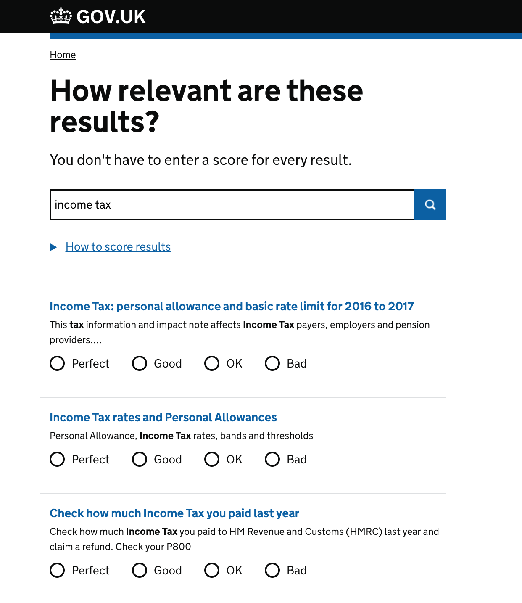

# Search relevance scoring tool

This prototype can be used to collect relevance judgements from users as they search gov.uk.

The tool is deployed to heroku, and can be accessed here: https://search-result-relevancy.herokuapp.com/



## Running the tool locally

```sh
$ ./startup.sh --live
```

## Accessing the data

```sh
$ ./judgements.sh
```
This will pull the contents of the app's heroku database to your local machine, and then export the data as a csv. There are a couple of prerequisites before you can run this script:

* You must have postgres installed and setup.
* You need to be added as a collaborator to the heroku app.
